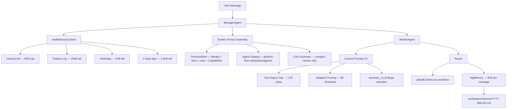

# OpenSpider Memory & Context Optimization — Deep Dive Analysis

> **Scope**: Complete audit of memory persistence, context window management, token efficiency, and cron job awareness across all agent subsystems.
> **Date**: March 9, 2026

---

## Architecture Overview



---

## ✅ Existing Optimizations (What We've Done)

### 1. Tiered Memory Window (`memory.ts`)
| Layer | Window | Limit |
|-------|--------|-------|
| Long-Term Memory | `memory.md` | 5,000 chars |
| Today | `YYYY-MM-DD.md` | 15,000 chars (tail) |
| Yesterday | Prior day log | 2,000 chars (tail) |
| 2 Days Ago | Older log | 1,500 chars (tail) |

**Total worst-case memory context: ~23.5KB ≈ 6K tokens**

### 2. Cron Context Isolation (`ManagerAgent.ts:77`)
Cron-triggered requests **skip memory injection** entirely, preventing cross-contamination (e.g., a baseball cron job seeing Iran conflict context).

### 3. Compact Cron Summary (`ManagerAgent.ts:81-93`)
Instead of injecting full cron prompts, only injects a one-liner: `[ACTIVE CRON JOBS] Daily Weather @07:00, Market Report every 24h`.

### 4. Dynamic Agent Catalog (`ManagerAgent.ts:34-69`)
Agent capabilities are loaded dynamically from `workspace/agents/` at request time — no stale hardcoded lists. Stopped agents (`status: 'stopped'`) are excluded.

### 5. V3 Adaptive Context Pruning (`WorkerAgent.ts:649-696`)
- Monitors **actual character length** of the message array (not a blind turn count)
- Triggers pruning at **6,000 chars** (~2K tokens)
- Preserves `summary_of_findings` while stripping thoughts, code, and tool output
- Keeps System + User prompt and last 2 turns untouched

### 6. Tool Output Hard Cap (`WorkerAgent.ts:636-644`)
All tool output truncated to **1,500 chars** with head+tail retention (800+700) so the agent sees both the beginning and end of output.

### 7. Browser Content Cap
`read_content` in the browser tool caps page text at **1,500 chars**, with targeted CSS selector support (`"args": "table"`) for focused extraction.

### 8. Per-Message Memory Truncation (`memory.ts:118-120`)
Individual messages logged at max **4,000 chars** (raised from 500 to preserve links/tables).

### 9. Iteration Budget + Wrap-Up Warning (`WorkerAgent.ts:117-140`)
- Research tasks: 80 iterations max, warning at 70
- Coding tasks: 200 iterations max, warning at 175
- Warning injects a system message forcing immediate `final_answer`

### 10. Chat Buffer Persistence (`server.ts:99-152`)
Disk-backed `workspace/chat_buffer.json` with debounced writes (2s) and SIGINT/SIGTERM flush. Survives gateway restarts.

### 11. 1,500-Token Output Cap for Manager (`ManagerAgent.ts:117`)
Manager's plan generation is capped to prevent JSON truncation crashes.

### 12. `summary_of_findings` Field (`WorkerAgent.ts:163`)
Each worker step retains a compressed 1-2 sentence summary even after pruning — this is the "memory" that survives context compaction.

---

## 🔴 Gaps & Inefficiencies Found

### Gap 1: Global Context Accumulates Without Bounds
**File**: [ManagerAgent.ts:309](file:///Users/vbalaraman/OpenSpider/src/agents/ManagerAgent.ts#L309)

```typescript
globalContext.push(`Task ${taskId} Result from ${step.role}: ${result}`);
```

Each worker result is pushed to `globalContext` **verbatim**. A 3-step plan where each worker returns 2KB = **6KB+ of context** injected into every subsequent worker's system prompt. For 5+ step plans, this can hit 15KB+ before the worker even starts.

> [!CAUTION]
> **Impact**: Token bloat compounds linearly with plan size. A 5-step plan can inject 10K+ tokens of stale context into the final worker.

### Gap 2: No Conversation-Level Summarization
The system logs raw conversation text and replays it. There's no mechanism to **summarize** a completed conversation into a compact form. After a busy day, today's log can hit 15KB easily — mostly redundant intermediate dialogue.

### Gap 3: Memory Files Grow Forever
Daily `.md` files in `workspace/memory/` are never cleaned up. After months of operation, the directory grows unbounded. While only 3 days are loaded, disk usage grows silently.

### Gap 4: PersonaShell Injects Full Capabilities JSON
**File**: [PersonaShell.ts:185](file:///Users/vbalaraman/OpenSpider/src/agents/PersonaShell.ts#L185)

```typescript
prompt += `[CAPABILITIES & LOADOUT]\n${JSON.stringify(caps, null, 2)}\n\n`;
```

The full CAPABILITIES.json (including `dataSources`, `alertChannels`, `maxDelegationDepth`, etc.) is injected as pretty-printed JSON. Much of this is operational metadata the LLM doesn't need.

### Gap 5: No Token Counting — Only Character Heuristics
All pruning thresholds use **character counts** (6K chars ≈ 2K tokens). This is a rough 3:1 approximation that breaks down with code, JSON, and non-English text. No actual tiktoken/tokenizer integration exists.

### Gap 6: Skills Metadata Injected Verbatim
**File**: [WorkerAgent.ts:38-46](file:///Users/vbalaraman/OpenSpider/src/agents/WorkerAgent.ts#L38-L46)

Each assigned skill's full JSON metadata (name, description, instructions) is injected into the worker's system prompt. Agents with 8 skills (Pitwall, Sentinel) add ~2KB of skill documentation per invocation.

### Gap 7: Parallel Task Results Not Summarized
**File**: [ManagerAgent.ts:342](file:///Users/vbalaraman/OpenSpider/src/agents/ManagerAgent.ts#L342)

Parallel block results are joined and pushed as one massive string without compression.

### Gap 8: No Semantic Deduplication in Memory Logs
If a user asks the same question twice, both Q&A pairs are logged fully. The agent re-reads duplicate information from yesterday's/today's context.

### Gap 9: WhatsApp Messages Not Distinguished from Dashboard Messages
Both channels write to the same `logMemory` function. The agent has no way to distinguish "I already answered this on WhatsApp" from "The user asked this on the dashboard."

### Gap 10: Cron Job Context Missing from Workers
Workers executing cron tasks receive no information about **other active cron jobs** or their schedules. If a cron job needs to reference another job's output, it has no access.

---

## 🚀 Proposed Optimizations

### Priority 1: Global Context Compaction (High Impact, Medium Effort)

**Problem**: `globalContext` grows linearly with plan steps.

**Solution**: After each worker completes, summarize its result into ≤500 chars before pushing to `globalContext`:

```typescript
// Instead of:
globalContext.push(`Task ${taskId} Result from ${step.role}: ${result}`);

// Do:
const compactResult = result.length > 500
    ? await this.llm.generate([
        { role: 'system', content: 'Summarize this task result in 2-3 sentences, preserving any URLs, numbers, and key findings.' },
        { role: 'user', content: result }
      ])
    : result;
globalContext.push(`Task ${taskId} (${step.role}): ${compactResult}`);
```

**Cost**: 1 extra LLM call per step (cheap summarization model).
**Savings**: 60-80% context reduction for multi-step plans.

---

### Priority 2: End-of-Day Conversation Summarization (High Impact, Low Effort)

**Problem**: Daily logs grow to 15KB of raw conversation.

**Solution**: Add a nightly compaction cron that summarizes the day's log:

```
[11:59 PM] === DAY SUMMARY ===
- User scheduled daily market reports via Sentinel
- Created Pitwall F1 agent with 8 skills
- Fixed chat lock bug (chatDoneRef guard)
- Fixed chat persistence (disk-backed buffer)
```

This runs as a system task at midnight, replacing the raw log with a ~500-char summary while archiving the original.

---

### Priority 3: LLM-Aware Token Counting (Medium Impact, Medium Effort)

**Problem**: Character-based thresholds (6K chars) are imprecise.

**Solution**: Integrate a fast tokenizer (e.g., `tiktoken` via a Node.js binding or `gpt-tokenizer` npm package) for accurate token counting:

```typescript
import { encode } from 'gpt-tokenizer';
const tokenCount = encode(fullPrompt).length;
const DANGER_THRESHOLD = 3000; // tokens, not chars
```

---

### Priority 4: Smart Persona Context (Low Effort, High Impact)

**Problem**: `PersonaShell` injects full CAPABILITIES.json including operational metadata.

**Solution**: Only inject LLM-relevant fields:
```typescript
const llmRelevantCaps = {
    name: caps.name,
    role: caps.role,
    tools: caps.allowedTools || caps.tools,
};
prompt += `[CAPABILITIES]\n${JSON.stringify(llmRelevantCaps)}\n\n`;
```

**Savings**: ~200-500 tokens per invocation.

---

### Priority 5: Skill Context Lazy Loading (Medium Impact, Low Effort)

**Problem**: All 8 skill metadata files injected into every worker prompt, even if the task only needs 1 skill.

**Solution**: Include only skill names in the system prompt. When the worker calls `execute_script`, inject that specific skill's full metadata just-in-time:

```
YOUR SKILLS: f1_race_predictor, f1_qualifying_analysis, f1_track_intelligence, ...
To learn about a skill, call: execute_script with filename "f1_race_predictor.py --help"
```

**Savings**: ~1.5KB per invocation for 8-skill agents.

---

### Priority 6: Memory Retention Policy (Low Impact, Low Effort)

Auto-delete daily logs older than 30 days. Add to `initWorkspace()`:

```typescript
const cutoff = Date.now() - (30 * 24 * 60 * 60 * 1000);
for (const file of fs.readdirSync(MEMORY_DIR)) {
    const stat = fs.statSync(path.join(MEMORY_DIR, file));
    if (stat.mtimeMs < cutoff) fs.unlinkSync(path.join(MEMORY_DIR, file));
}
```

---

### Priority 7: Channel-Tagged Memory

Tag each log entry with its source channel:

```
[10:30 AM] **User** (📱WhatsApp): What's the weather?
[10:31 AM] **Agent** (📱WhatsApp): It's 72°F and sunny.
[11:00 AM] **User** (🖥️Dashboard): Create a new F1 agent
```

This prevents the agent from confusing cross-channel conversations.

---

## 📊 Token Budget Breakdown (Current State)

| Component | Estimated Tokens | Notes |
|-----------|-----------------|-------|
| PersonaShell (Identity+Soul+User+Caps) | ~800-1,200 | Per agent invocation |
| Memory Context (3-day tiered) | ~4,000-6,000 | Worst case with full day |
| Agent Catalog + Routing Rules | ~1,500-2,000 | Grows with each new agent |
| Cron Summary | ~50-200 | Very compact |
| Worker System Prompt (instructions) | ~1,500 | Fixed template |
| Skill Metadata (8 skills) | ~500-800 | Verbatim injection |
| globalContext (accumulated results) | ~500-5,000+ | **Unbounded, biggest risk** |
| **Total Manager Prompt** | **~8,000-14,000** | |
| **Total Worker Prompt** | **~3,000-8,000** | |

> [!IMPORTANT]
> The **globalContext accumulation** (Gap 1) is the single largest risk factor. A 5-step plan can push total token usage past 20K, approaching model limits and dramatically increasing cost.

---

## 🏆 Industry Benchmarks

| Feature | OpenSpider (Current) | AutoGPT | CrewAI | LangGraph |
|---------|---------------------|---------|--------|-----------|
| Tiered Memory Window | ✅ 3-day | ❌ Single file | ❌ None | ⚠️ Manual |
| Context Pruning | ✅ V3 Adaptive | ⚠️ Fixed turn | ❌ None | ✅ Configurable |
| Token Counting | ❌ Char heuristics | ✅ tiktoken | ❌ None | ✅ tiktoken |
| Long-Term Memory | ✅ File-based | ✅ Pinecone | ⚠️ Memory module | ✅ Checkpoints |
| Result Compaction | ❌ Verbatim pass | ❌ None | ✅ Summarize | ⚠️ Manual |
| Cron Isolation | ✅ Full skip | N/A | N/A | N/A |
| Disk-Backed Chat | ✅ JSON buffer | ❌ None | N/A | ✅ State persist |
| Semantic Search | ❌ Not yet | ✅ Embeddings | ⚠️ Optional | ✅ Vector store |

---

## Recommended Implementation Order

| # | Optimization | Impact | Effort | Risk |
|---|-------------|--------|--------|------|
| 1 | Global Context Compaction | 🔴 Critical | Medium | Low |
| 2 | Smart Persona Context | 🟡 High | Low | Low |
| 3 | Skill Context Lazy Loading | 🟡 High | Low | Low |
| 4 | End-of-Day Summarization | 🟡 High | Medium | Low |
| 5 | Memory Retention Policy | 🟢 Medium | Low | Low |
| 6 | Channel-Tagged Memory | 🟢 Medium | Low | Low |
| 7 | Token Counting Integration | 🟢 Medium | Medium | Low |

> [!TIP]
> Priorities 1-3 can be implemented in a single session and will cut token usage by **40-60%** for multi-step plans.
